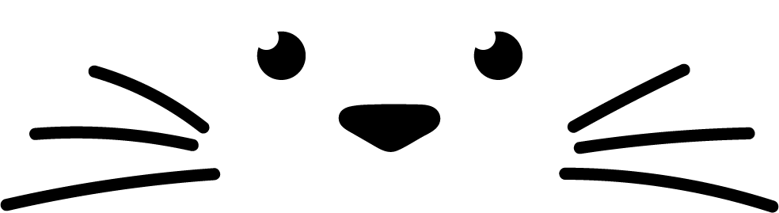
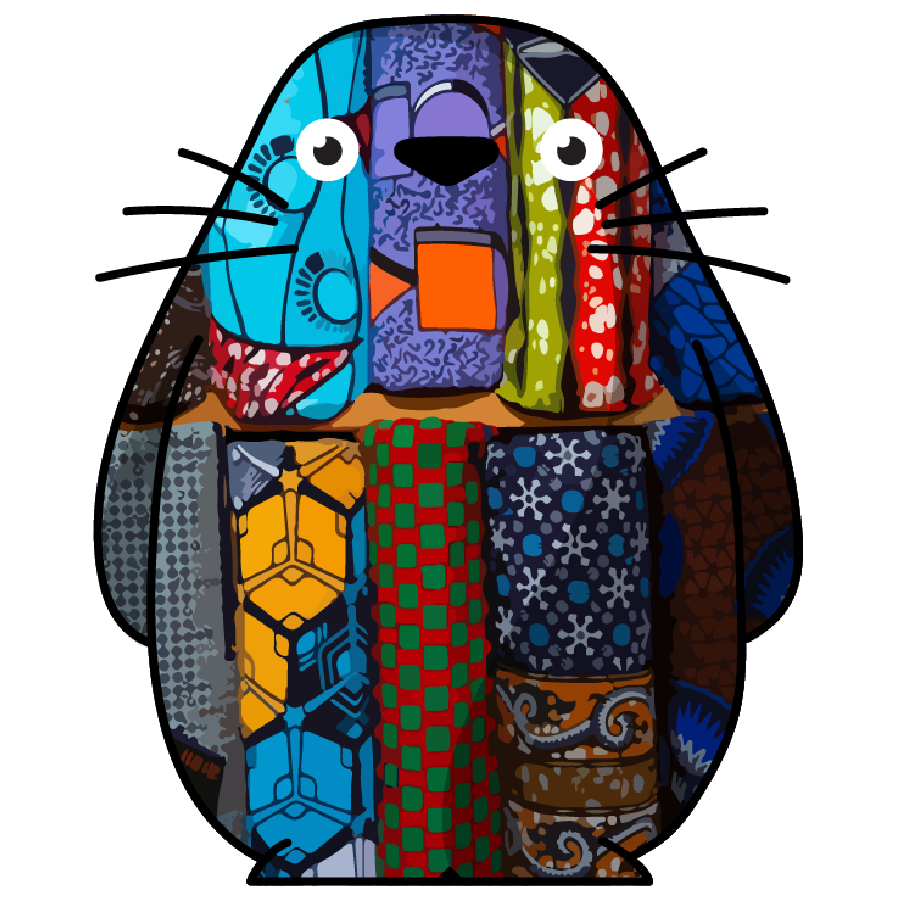

<!-- PROJECT HEADER -->

<br />
<div align="center">
  <a href="https://toro-domain-service.vercel.app/">
    
    <h1>TORO DOMAIN SERVICE <br/>Your immortal .toro on Polygon!</h1>
  </a>
  
  <p align="center">
    <a href="https://toro-domain-service.vercel.app/"><strong>#stayTORO »</strong></a>
    <br />
    <a href="https://toro-domain-service.vercel.app/">View Project</a>
    |
    <a href="https://github.com/githubotoro/toro-domain-service-web3-app/issues">Report Bug</a>
    |
    <a href="https://github.com/githubotoro/toro-domain-service-web3-app/issues">Request Feature</a>
    <br/>
    <a href="https://opensea.io/collection/totorulla">OpenSea</a>
    |
    <a href="https://twitter.com/totorulla">Twitter</a>
    |
    <a href="https://www.instagram.com/totorulla/">Instagram</a> <br/> <br/>
    <b>If you like this project, don't forget to give it a star! <br/> Thanks! 😊</b>
  </p>
  
</div>

<!-- PROJECT HEADER -->

<!-- TABLE OF CONTENTS -->

## Table of Contents 📌

  <ol>
    <li>
      <a href="#about-the-project">About The Project</a>
      <ul>
        <li><a href="#built-with">Built With</a></li>
      </ul>
    </li>
    <li>
      <a href="#getting-started">Getting Started</a>
      <ul>
        <li><a href="#installation">Installation</a></li>
      </ul>
    </li>
    <li><a href="#contributing">Contributing</a></li>
    <li><a href="#license">License</a></li>
    <li><a href="#contact">Contact</a></li>
    <li><a href="#acknowledgements">Acknowledgments</a></li>
  </ol>

<!-- ABOUT THE PROJECT -->

<a name="about-the-project"></a>

## About The Project 📝

<div align="center">
<a href="https://opensea.io/collection/totorulla">
    
</a>
</div>

Totorulla is a hand-drawn totogenic NFT collection of Totoru Family on OpenSea. This project is the official expansion for the community where everyone can be a part of the "Totoru Family" by minting their own .toro domain on Polygon. Join the totoric world of "Totoru Family" and be that "Totorulla" which was hidden inside you all along. 👀

<!-- ABOUT THE PROJECT -->

<!-- BUILT WITH -->

<a name="built-with"></a>

### Built With 🔍

-   [React.js](https://reactjs.org/)
-   [Ethers.js](https://docs.ethers.io/v5/)
-   [Web3.js](https://web3js.readthedocs.io/en/v1.7.0/)
-   [Alchemy](https://www.alchemy.com/)
-   [SweetAlert2](https://sweetalert2.github.io/)

<!-- BUILT WITH -->

<!-- GETTING STARTED -->

<a name="getting-started"></a>

## Getting Started 🚀

All you need to get started with this toroic project is your **toroness!** 😄

<a name="installation"></a>

### Installation 💻

1.  **Clone** this repo.
    ```sh
    git clone https://github.com/githubotoro/toro-domain-service-web3-app.git
    ```
2.  **(Optional)** Modify **CONTRACT_ADDRESS** in **App.js** under **/src** and update **contractABI.json** under **/src/utils** according to your smart contract or you can use mine as well.

    ```js
    const CONTRACT_ADDRESS = "YOUR_SMART_CONTRACT_ADDRESS";
    ```

    > **NOTE: If you want to make changes to smart contract, refer this **[toro-domain-service-hardhat](https://github.com/totorulla/toro-domain-service-hardhat)** project and don't forget to update CONTRACT_ADDRESS and contractABI.json in your web3 app after deployment.**

3.  Get your own **Alchemy API Key** on **"Polygon Mumbai Testnet"** from **[Alchemy](https://www.alchemy.com/).** Make a **.env** file in the root directory and enter the following line.

    ```sh
    REACT_APP_ALCHEMY_KEY = "YOUR_ALCHEMY_API_KEY"
    ```

    > **NOTE: Never push your .env file to GitHub.**

4.  **Install** NPM packages.
    ```sh
    npm install
    ```
5.  **Start** the project.

    ```sh
    npm start
    ```

6.  **Happy TOROing!**

<!-- GETTING STARTED -->

<!-- CONTRIBUTING -->

<a name="contributing"></a>

## Contributing 🤝

Totorulla is a community project and any contributions you make are greatly appreciated. If you have a suggestion that would make this better, please fork the repo and create a pull request. You can also simply open an issue with the tag "toro". 🏷

1. Fork the Project
2. Create your Feature Branch (`git checkout -b feature/ToroFeature`)
3. Commit your Changes (`git commit -m 'Add some ToroFeature'`)
4. Push to the Branch (`git push origin feature/ToroFeature`)
5. Open a Pull Request

<!-- CONTRIBUTING -->

<!-- LICENSE -->

<a name="license"></a>

## License 📃

Distributed under the **MIT License**. See `LICENSE` for more information.

<!-- LICENSE -->

<!-- CONTACT -->

<a name="contact"></a>

## Contact ☎️

> **Totorulla NFT Collection** : [OpenSea](https://opensea.io/collection/totorulla) | [Instagram](https://www.instagram.com/totorulla/)

-   **Twitter** - [tororulla](https://twitter.com/totorulla)
-   **Email** - totorullas@gmail.com

> **GitHub Project Link** : [https://github.com/githubotoro/toro-domain-service-web3-app](https://github.com/githubotoro/toro-domain-service-web3-app)

> **Deployed Project Link** : [https://toro-domain-service.vercel.app](https://toro-domain-service.vercel.app)

<!-- CONTACT -->

<!-- ACKNOWLEDGMENTS -->

<a name="acknowledgements"></a>

## Acknowledgments 🙌

-   [Buildspace](https://buildspace.so/)
-   [Choose an Open Source License](https://choosealicense.com)
-   [Get Emoji](https://getemoji.com/)

<!-- ACKNOWLEDGMENTS -->

<div align="center">
  <a href="https://opensea.io/collection/totorulla">
    
    <h1>Till then, #stayTORO 👋</h1>
  </a>
</div>
